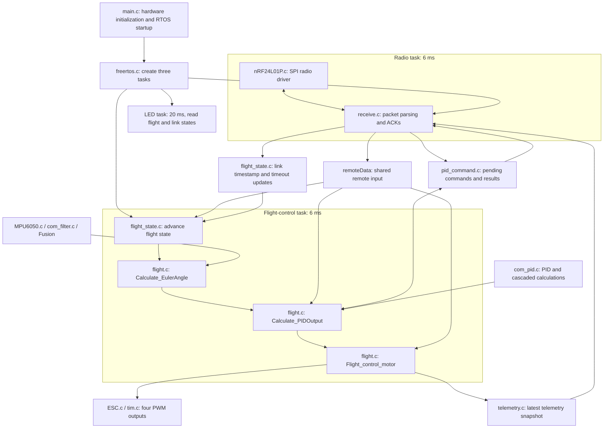

# STM32F103 Flight Controller

[繁體中文](README.md) | **English**

A quadrotor flight controller built with **STM32F103, FreeRTOS, MPU6050, and Fusion**, paired with a custom radio controller and Python tools for live telemetry and PID tuning. It has been **flight-tested on an F450 frame**.

The project covers attitude estimation, cascaded PID control, four-motor mixing, radio control, telemetry, and live parameter updates. Tests and protocol documentation are included for learning and further development.


## Flight demonstration

Click the image to watch the **first flight test compilation of the custom STM32 flight controller**:

[](https://youtu.be/hEEcJP3LDC0)

[Watch on YouTube](https://youtu.be/hEEcJP3LDC0)

The video shows the author's F450 flight tests. The motors, ESCs, propellers, battery, motor directions, and flight-tested PID gains supplied by the author are listed below.

## Features and current status

| Feature | Implementation |
| --- | --- |
| Attitude estimation | MPU6050 acceleration and angular velocity, startup calibration, filtering, and Fusion AHRS without a magnetometer |
| Roll / Pitch | Outer angle PID → inner angular-rate PID; stick targets within ±10° |
| Yaw | Angular-rate PID only; stick targets within ±90°/s |
| Motor output | X-configuration quadrotor mixer, four TIM4 PWM channels, output limiting |
| Radio control | nRF24L01-series module, control packet validation, and link timeout detection |
| Telemetry | 31-byte ACK payload, selectable X / Y / Z axis, and all four PWM outputs |
| Live tuning | PID updates over the controller's USB and radio links; parameters stored in RAM |
| Desktop tools | Live plots, axis selection, CSV recording, and PID application acknowledgments |

Altitude hold is not implemented. The current `FIX_HEIGHT` branch sends motor-stop commands and must not be treated as an available flight mode. The yaw angle outer loop has a parameter interface but is not connected to the control path.

## System architecture

The existing images are shared with the Chinese README; some diagram labels are in Chinese. English explanations are provided below.


The main flight-control sequence is: remote input and state processing → IMU acquisition and attitude estimation → PID → motor mixing and output → telemetry snapshot.

| FreeRTOS task | Priority | Target period | Responsibilities |
| --- | --- | --- | --- |
| Flight control | High | 6 ms, approximately 166.7 Hz | State machine, IMU, attitude, PID, motors, and telemetry capture |
| Radio | Normal | 6 ms | Receive control/tuning packets, prepare ACKs, update link state |
| LED | Low | 20 ms | Display link and armed/disarmed status |

These are configured periods, not measured worst-case execution times. TIM4 PWM runs at 400 Hz, independently of the control-loop update rate.

### Software modules and tasks

The following diagram reflects the current implementation. Arrows show major data flows or module relationships; they do not represent separate tasks for every connection.



State transitions, attitude estimation, PID, and motor mixing execute sequentially in one flight-control task. The radio task updates remote input and link state and receives tuning commands; the flight-control task applies PID parameters. Telemetry is exchanged as a snapshot, while `remoteData` remains a shared structure without an atomic snapshot of the complete packet.

| Source entry point | Main responsibilities |
| --- | --- |
| [freertos.c](Core/Src/freertos.c) | Task creation, initialization order, priorities, and periods |
| [flight.c](Core/Src/flight.c) | Attitude estimation, default PID gains, target conversion, mixing, and telemetry capture |
| [flight_state.c](Core/Src/flight_state.c) | Arming, mode transitions, and link/disconnection states |
| [receive.c](Core/Src/receive.c) | Control/tuning packet dispatch and ACKs carrying telemetry or command results |
| [pid_command.c](Core/Src/pid_command.c) | Parameter command handoff, application, and results |
| [telemetry.c](Core/Src/telemetry.c) | Telemetry quantization, publication, and latest-snapshot copying |

### Attitude estimation and control

Gyroscope data passes through a first-order low-pass filter, and each accelerometer axis uses a Kalman filter. Axis mapping, FusionBias, and Fusion AHRS then produce body angular rates and attitude angles. The configured convention is NWU: X forward, Y left, Z up. The current sensor mapping does not swap axes, so the physical installation must match.

Attitude estimation and quaternion-to-Euler conversion use [xioTechnologies/Fusion](https://github.com/xioTechnologies/Fusion), with sources in `Middlewares/Third_Party/Fusion/`.


This diagram applies to roll and pitch. The outer loop compares the target angle with the estimated attitude and produces a target angular rate. The inner loop compares that target with the measured angular rate and produces a mixer correction. Yaw uses an angular-rate target directly, without an angle outer loop. Rate controllers use derivative-on-measurement and D-term low-pass filtering.

### Telemetry and tuning


The flight controller publishes a snapshot of PID data and four PWM commands from the same iteration. Radio ACK payloads carry it to the remote controller, which forwards it to the PC over USB. PID updates travel in the opposite direction and are applied within the flight-control loop.

## Hardware and wiring

| Component | Current platform |
| --- | --- |
| Frame | F450 |
| MCU | STM32F103, configured clock: 72 MHz |
| IMU | MPU6050, I2C2 at 400 kHz |
| Radio | nRF24L01-series module, SPI1 |
| Motors | SunnySky A2212 KV980 × 4 |
| ESCs | XRotor 20A 4S BLDC × 4 |
| Propellers | 9450 |
| Battery | 4S, 6200 mAh, 90C |
| Remote controller | Custom dual-stick controller with a USB bridge to the PC; [stm32f411-remote-controller](https://github.com/ZHANG-XICHANG/stm32f411-remote-controller) |
| Programmer | ST-Link over SWD |

| Flight controller | Remote controller |
| --- | --- |
|  |  |


The following table reflects the current firmware configuration. Power and regulator wiring must also match the actual module specifications.

| STM32 pin | Function | Connection |
| --- | --- | --- |
| PB10 / PB11 | I2C2 SCL / SDA | MPU6050 SCL / SDA |
| PA5 / PA6 / PA7 | SPI1 SCK / MISO / MOSI | Corresponding radio module pins |
| PA3 / PA4 | CE / CSN | Radio module CE / CSN |
| PB6 | TIM4 CH1 | M1 ESC signal |
| PB7 | TIM4 CH2 | M2 ESC signal |
| PB8 | TIM4 CH3 | M3 ESC signal |
| PB9 | TIM4 CH4 | M4 ESC signal |
| PA9 / PA10 | USART1 TX / RX | Debug UART, 115200 baud |
| PA13 / PA14 | SWDIO / SWCLK | SWD programmer/debugger |
| PB1 / PB2 | LED2 / LED | Status indicators |

Motor positions in the code and directions confirmed by the author are shown below, **viewed from above the aircraft**. CW means clockwise; CCW means counterclockwise.

```text
           Front / +X
      M1 CCW      M2 CW
            Center
      M4 CW       M3 CCW
           +Y points left
```

PWM commands range from 1100 to 1940 µs. `ESC_Stop()` continues to output 1100 µs rather than disabling PWM; the actual stop behavior must match the ESC calibration.

## Build and flash

Development uses **VS Code with the STM32CubeIDE extension**. **STM32CubeMX** configures MCU peripherals and CMSIS/FreeRTOS settings and generates initialization and build-related code. The CubeMX configuration is stored in `P01_flight_hal.ioc`.

Requirements: CMake 3.22 or later, Ninja, and the Arm GNU Toolchain (`arm-none-eabi-gcc`, `arm-none-eabi-g++`, and related tools available on PATH). HAL, CMSIS, FreeRTOS, and Fusion sources are included, along with the STM32CubeMX `.ioc` file.

```sh
git clone https://github.com/ZHANG-XICHANG/stm32f103-flight-controller.git
cd stm32f103-flight-controller
cmake --preset Debug
cmake --build --preset Debug
```

For a Release build:

```sh
cmake --preset Release
cmake --build --preset Release
```

The CMake target remains `P01_flight_hal`, so the output is `build/Debug/P01_flight_hal.elf` or `build/Release/P01_flight_hal.elf`. Use a fresh build directory after renaming the project directory or changing toolchains.

This project uses an ST-Link programmer. The ELF can be flashed over SWD using STM32CubeProgrammer. Connect SWDIO, SWCLK, GND, and the target voltage reference as required by the programmer. Development software versions are still to be documented.

### Startup and operation

1. Remove propellers when checking initial wiring, motor numbering, and output directions.
2. After power-on, keep the aircraft level and stationary with its Z axis pointing up until IMU calibration completes.
3. Establish a link using compatible remote-controller firmware.
4. Firmware arming requires throttle below 10, yaw/pitch/roll each within 490–510, and a `power=1` event. Physical button mappings remain to be documented with the remote controller.
5. In normal mode, throttle below 10 sends motor-stop commands. Another `power=1` event returns the controller to the disarmed state.

This repository contains flight-controller firmware and desktop tools. Remote-controller firmware is maintained in the separate [stm32f411-remote-controller](https://github.com/ZHANG-XICHANG/stm32f411-remote-controller) repository (original project name: `F411_remote_hal`). Radio control and USB telemetry require protocol-compatible remote firmware. Matching versions or commits for both ends remain to be documented.

## Desktop telemetry and PID tuning

Use Python 3 and install the dependencies:

```sh
python -m pip install pyserial matplotlib
```

The GUI uses Tkinter, which is usually included with Python on Windows. Ensure Tkinter is available on other platforms.

**Connect the PC to the remote controller's USB port**, then launch the integrated tool:

```sh
python pid_tune.py
```

Select the serial port and connect, choose a controller and Kp/Ki/Kd values, then click Apply PID. Only an `Applied` response confirms that the flight controller accepted the update. Changes are stored only in RAM; rebooting restores the defaults in the source code. Initial GUI values are not read back from the flight controller.


The five plots show the selected axis's attitude angle, target/measured angular rate, rate error, P/D/total PID output, and all four ESC PWM commands. Telemetry axis selects X/Y/Z for observation only; all three control axes continue operating.

For monitoring and recording only:

```sh
python serial_scope.py --list-ports
python serial_scope.py --port COM3 --csv telemetry_session_01.csv
```

Replace the port and choose a new CSV filename. The two tools cannot use the same serial port simultaneously. Plots use flight-controller sample timestamps. PWM values are commands, not measured motor speeds. Telemetry sends the latest snapshot, so sequence gaps are not a direct measure of radio packet loss.

Detailed documentation (Chinese): [PID tuning and command protocol](docs/pid_tuning.md) · [31-byte telemetry protocol](docs/telemetry.md)

## Tuning and testing


The photo shows the test rig used during development. Flight tuning depends on the frame, motors, propellers, battery, and payload; source-code defaults are not suitable for every configuration.

### PID gains used in the flight video

The author confirmed the following flight-test gains. They match the current defaults of the corresponding controllers in `Core/Src/flight.c`.

| Controller | Variable | Kp | Ki | Kd |
| --- | --- | --- | --- | --- |
| Roll (X) angle outer loop | `roll_pid` | 7.0 | 0.0 | 0.05 |
| Pitch (Y) angle outer loop | `pitch_pid` | 7.0 | 0.0 | 0.05 |
| Roll (X) rate inner loop | `gyro_x_pid` | 0.5 | 0.0 | 0.01 |
| Pitch (Y) rate inner loop | `gyro_y_pid` | 0.5 | 0.0 | 0.01 |
| Yaw (Z) rate inner loop | `gyro_z_pid` | 2.0 | 0.1 | 0.0 |

The yaw angle outer loop is inactive. These gains document this aircraft's flight setup. Full reproduction also requires the filtering, control period, propulsion configuration, and firmware version used in the video.

### Host-side tests

Run Python tests from the project root:

```sh
python -m unittest discover -s tests -p "test_*.py"
```

C tests cover PID calculations, the radio driver, PID commands, and telemetry. See [PID tests](tests/pid/README.md), [radio driver tests](tests/nrf24/README.md), `tests/pid_command/run.cmd`, and `tests/telemetry/run.cmd`. These host-side tests do not validate real-time scheduling on the board, physical RF links, or flight stability.

## Project layout

```text
Core/Inc/                  Firmware headers
Core/Src/                  Flight control, hardware interfaces, and RTOS tasks
Drivers/                   STM32 HAL and CMSIS
Middlewares/Third_Party/    FreeRTOS and Fusion
cmake/                     Toolchain and CubeMX build configuration
docs/                      Protocol documentation and images
tests/                     Host-side tests
pid_tune.py                Integrated PID tuning and telemetry GUI
serial_scope.py            Standalone telemetry and CSV recorder
P01_flight_hal.ioc         STM32CubeMX configuration
```

## Known limitations and future work

- Altitude hold is not implemented; `FIX_HEIGHT` currently sends motor-stop commands.
- No magnetometer is used, and yaw does not provide absolute heading hold.
- IMU read failures leave the previous attitude in use, and calibration failure does not yet block subsequent control processing.
- PID control lacks comprehensive integral limiting, reset-on-stop, and output saturation feedback handling.
- The remote timeout threshold is 1000 ms. Link loss sends motor-stop commands; reconnecting automatically returns to `NORMAL` without requiring re-arming.
- Control calculations assume a fixed 6 ms period. Actual execution timing and missed-read handling need further measurement and improvement.
- Power wiring, the firmware version used in the video, and compatible flight-controller/remote-controller versions or commits remain to be documented.

## Learning resources and acknowledgments

This project began by following [this Bilibili tutorial (BV1f8rbBSEq3)](https://www.bilibili.com/video/BV1f8rbBSEq3/) and gradually developed into the current F450 flight controller, tuning setup, and flight tests. Thanks to the original creator for the introductory tutorial.

The attitude-estimation library is [xioTechnologies/Fusion](https://github.com/xioTechnologies/Fusion). The tutorial and third-party library are listed separately to distinguish the project's learning background from its software dependencies.

## Third-party components and licensing

STM32 HAL, CMSIS, and FreeRTOS are integrated through STM32CubeMX configuration. Development and builds use the STM32CubeIDE extension in VS Code. Attitude estimation additionally uses Seb Madgwick's Fusion library. Preserve the original notices and license files for each component; integration through CubeMX does not change their respective licenses.

Fusion source: [xioTechnologies/Fusion](https://github.com/xioTechnologies/Fusion). The upstream project uses the [MIT License](https://github.com/xioTechnologies/Fusion/blob/main/LICENSE.md). The exact upstream version used here and a complete local copy of its license remain to be documented and included.

**License for project-authored code: unspecified (License: None).** No open-source license has currently been granted for the project-authored code. Third-party components remain subject to their own licenses.
