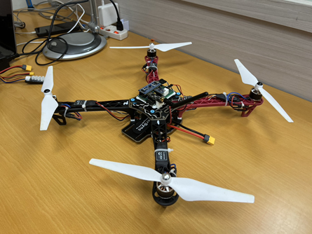
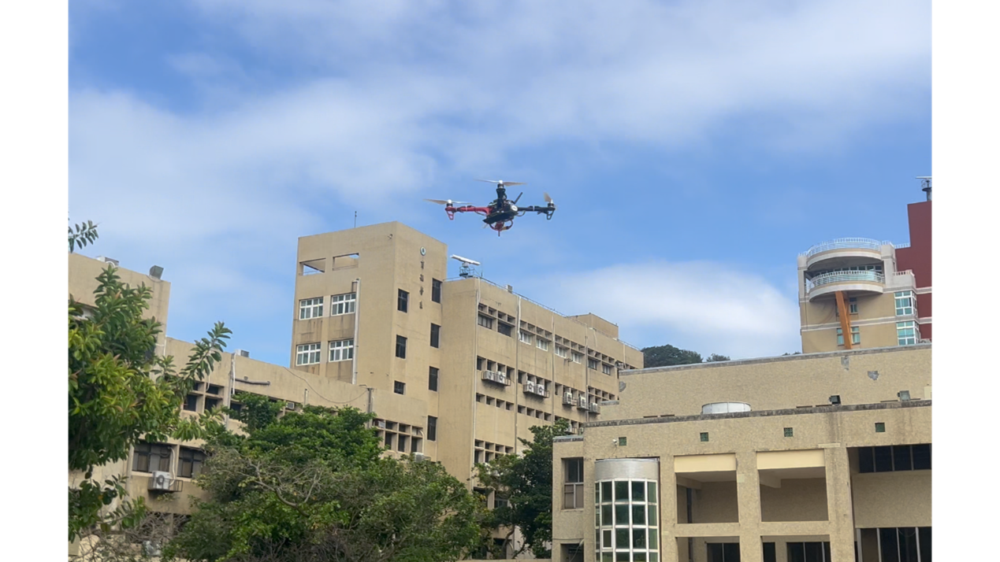
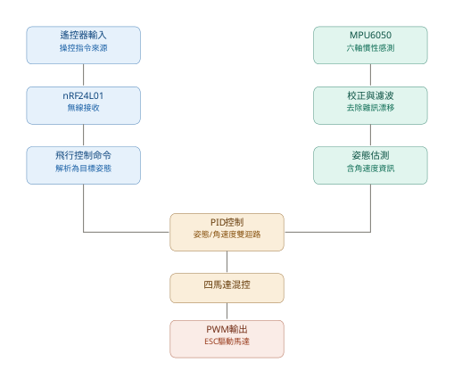
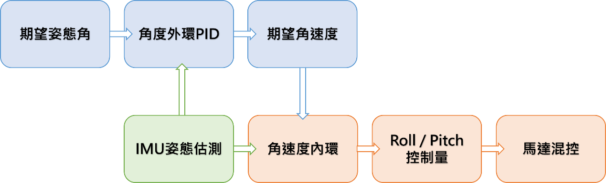
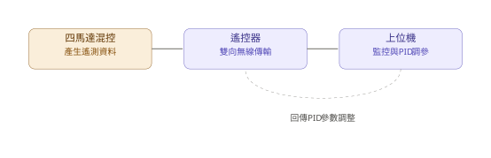
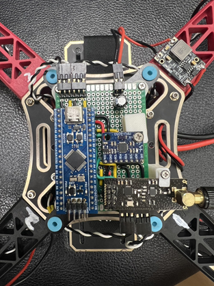
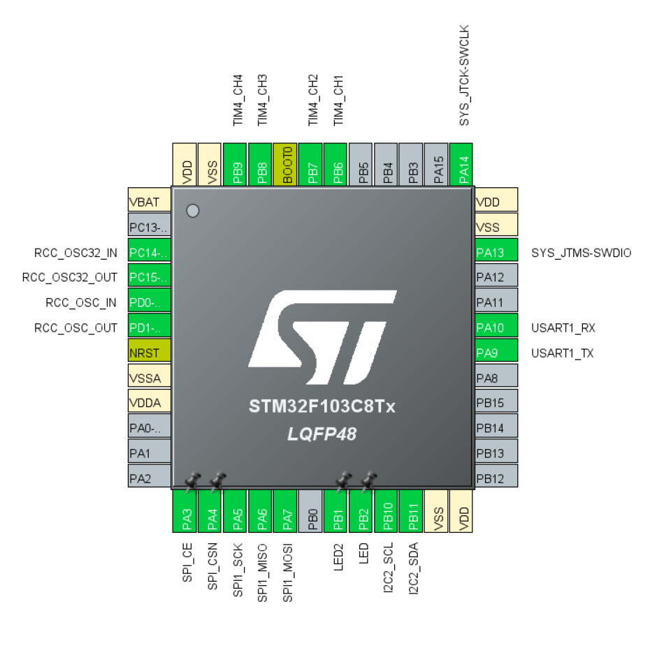
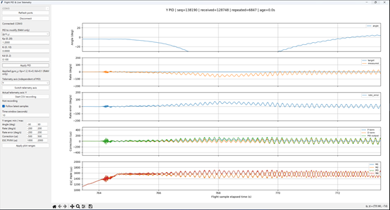
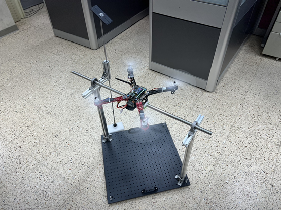

# STM32F103 Flight Controller

**繁體中文** | [English](README.en.md)

以 **STM32F103、FreeRTOS、MPU6050 與 Fusion** 開發的四旋翼飛控，搭配自製無線遙控器及 Python 即時遙測／PID 調參工具。已搭載於 **F450 機架完成實際飛行測試**。

專案涵蓋姿態估測、串級 PID、四馬達混控、無線操控、遙測及線上調參，並保留測試程式與通訊協定文件，供學習與後續開發參考。



## 飛行展示

點擊圖片觀看 **自製 STM32 飛控首次飛行測試影片合輯**：

[](https://youtu.be/hEEcJP3LDC0)

[觀看 YouTube 影片](https://youtu.be/hEEcJP3LDC0)

影片記錄作者的 F450 實飛成果。作者提供的馬達、ESC、槳葉、電池、馬達旋向及實飛 PID 參數列於下方。

## 功能與目前狀態

| 項目 | 實作內容 |
| --- | --- |
| 姿態估測 | MPU6050 加速度／角速度、開機校正、濾波、Fusion 無磁力計姿態估測 |
| Roll / Pitch | 角度外環 PID → 角速度內環 PID；搖桿目標範圍 ±10° |
| Yaw | 角速度單環 PID；搖桿目標範圍 ±90°/s |
| 馬達輸出 | X 型四旋翼混控、TIM4 四路 PWM、輸出限幅 |
| 無線操控 | nRF24L01 系列模組、控制封包驗證及失聯判斷 |
| 遙測 | 31-byte ACK payload，可選 X / Y / Z 軸，同時記錄四路 PWM |
| 線上調參 | 經遙控器 USB 與無線鏈路更新 PID，參數保存在 RAM |
| 電腦工具 | 即時曲線、軸切換、CSV 記錄與 PID 套用回覆 |

定高尚未實作；目前 `FIX_HEIGHT` 分支會送出停機指令，請勿將它當作可用飛行模式。Yaw 角度外環雖保留參數介面，尚未接入控制。

## 系統架構



飛控主流程為：遙控輸入與狀態判斷 → IMU 讀取及姿態估測 → PID → 馬達混控與輸出 → 遙測快照。

| FreeRTOS 任務 | 優先權 | 目標週期 | 職責 |
| --- | --- | --- | --- |
| 飛控 | High | 6 ms，約 166.7 Hz | 狀態機、IMU、姿態、PID、馬達與遙測快照 |
| 無線 | Normal | 6 ms | 接收控制／調參封包、準備 ACK、更新連線狀態 |
| LED | Low | 20 ms | 連線與解鎖狀態顯示 |

上述為程式設定週期，並非實測最壞執行時間。TIM4 PWM 為 400 Hz，與控制迴圈更新率不同。

### 程式模組與任務關係

以下對應目前程式實作；箭頭表示主要資料流或模組使用關係，不代表每條連線都有獨立任務。

```mermaid
flowchart TB
    Boot["main.c：硬體初始化與啟動 RTOS"] --> Tasks["freertos.c：建立三個任務"]

    subgraph RadioTask["無線任務：6 ms"]
        Radio["nRF24L01P.c：SPI 無線驅動"] <--> Receive["receive.c：封包解析與 ACK"]
    end

    subgraph FlightTask["飛控任務：6 ms"]
        State["flight_state.c：推進飛行狀態"] --> Attitude["flight.c：Calculate_EulerAngle"]
        Attitude --> Control["flight.c：Calculate_PIDOutput"]
        Control --> Motors["flight.c：Flight_control_motor"]
    end

    Tasks --> Receive
    Tasks --> State
    Tasks --> LED["LED 任務：20 ms，讀取飛行與連線狀態"]
    Receive --> Remote["remoteData：共享遙控輸入"]
    Remote --> State
    Remote --> Control
    Remote --> Motors
    Receive --> Link["flight_state.c：連線時間與逾時更新"]
    Link --> State
    Receive --> Commands["pid_command.c：待套用命令與結果"]
    Commands <--> Control
    Commands --> Receive
    IMU["MPU6050.c / com_filter.c / Fusion"] --> Attitude
    PID["com_pid.c：PID 與串級計算"] --> Control
    Motors --> ESC["ESC.c / tim.c：四路 PWM"]
    Motors --> Telemetry["telemetry.c：最新遙測快照"]
    Telemetry --> Receive
```



狀態轉移、姿態估測、PID 與混控依序在同一個飛控任務內執行。無線任務更新遙控資料及連線狀態，並收取調參命令；PID 參數由飛控任務套用。遙測透過快照交換，`remoteData` 則仍是共享結構，尚未改為整包原子快照。

| 閱讀入口 | 主要職責 |
| --- | --- |
| [freertos.c](Core/Src/freertos.c) | 任務建立、初始化順序、優先權及週期 |
| [flight.c](Core/Src/flight.c) | 姿態估測、預設 PID、目標轉換、混控及遙測擷取 |
| [flight_state.c](Core/Src/flight_state.c) | 解鎖、模式切換、連線與失聯狀態 |
| [receive.c](Core/Src/receive.c) | 控制／調參封包分流、遙測與命令結果 ACK |
| [pid_command.c](Core/Src/pid_command.c) | 參數命令交接、套用與結果回覆 |
| [telemetry.c](Core/Src/telemetry.c) | 遙測量化、發布與複製最新快照 |

### 姿態與控制

Gyro 使用一階低通，Accel 各軸使用 Kalman 濾波，再經座標映射、FusionBias 與 Fusion AHRS 產生機體角速度及姿態角。程式採 NWU 座標：X 朝前、Y 朝左、Z 朝上；目前感測器映射不換軸，安裝方向必須對應。

姿態估測與四元數轉歐拉角使用 [xioTechnologies/Fusion](https://github.com/xioTechnologies/Fusion)，原始碼位於 `Middlewares/Third_Party/Fusion/`。



此圖適用於 Roll／Pitch：角度外環比較目標角度與估測姿態，輸出目標角速度；角速度內環再與量測角速度比較，產生混控修正量。Yaw 直接使用目標角速度，不經角度外環。角速度內環採量測值微分與 D 項低通濾波。

### 遙測與調參



飛控發布同一輪 PID 與四路 PWM 快照，經無線 ACK 傳至遙控器，再由遙控器 USB 傳至電腦。PID 參數則沿相反方向送回飛控，於控制迴圈中套用。

## 硬體與接線

| 元件 | 目前平台 |
| --- | --- |
| 機架 | F450 |
| 主控 | STM32F103，專案時鐘 72 MHz |
| IMU | MPU6050，I2C2，400 kHz |
| 無線 | nRF24L01 系列模組，SPI1 |
| 馬達 | SunnySky A2212 KV980 × 4 |
| ESC | XRotor 20A 4S BLDC × 4 |
| 槳葉 | 9450 |
| 電池 | 4S、6200 mAh、90C |
| 操控端 | 自製雙搖桿無線遙控器，提供電腦 USB 橋接；獨立專案 `F411_remote_hal` |
| 燒錄器 | ST-Link，SWD 介面 |

| 飛控板 | 遙控器 |
| --- | --- |
|  |  |



以下依目前韌體配置整理，電源與穩壓接線仍需配合實際模組規格。

| STM32 腳位 | 功能 | 連接對象 |
| --- | --- | --- |
| PB10 / PB11 | I2C2 SCL / SDA | MPU6050 SCL / SDA |
| PA5 / PA6 / PA7 | SPI1 SCK / MISO / MOSI | 無線模組對應腳位 |
| PA3 / PA4 | CE / CSN | 無線模組 CE / CSN |
| PB6 | TIM4 CH1 | M1 ESC 訊號 |
| PB7 | TIM4 CH2 | M2 ESC 訊號 |
| PB8 | TIM4 CH3 | M3 ESC 訊號 |
| PB9 | TIM4 CH4 | M4 ESC 訊號 |
| PA9 / PA10 | USART1 TX / RX | 除錯串口，115200 baud |
| PA13 / PA14 | SWDIO / SWCLK | SWD 燒錄／除錯器 |
| PB1 / PB2 | LED2 / LED | 狀態指示 |

程式中的馬達位置與作者確認的旋向如下，均以**從機體上方向下俯視**為準（CW：順時針；CCW：逆時針）。

```text
           機頭 / +X
      M1 CCW      M2 CW
             中心
      M4 CW       M3 CCW
           +Y 朝左
```

PWM 指令範圍為 1100～1940 µs；`ESC_Stop()` 持續輸出 1100 µs，並不關閉 PWM，停轉行為須與實際 ESC 校準一致。

## 建置與燒錄

本專案在 **VS Code 中使用 STM32CubeIDE 擴充套件**開發，透過 **STM32CubeMX** 配置 MCU 周邊、CMSIS／FreeRTOS 相關設定並產生初始化與建置所需程式。CubeMX 設定保存在 `P01_flight_hal.ioc`。

需要 CMake 3.22 以上、Ninja 與 Arm GNU Toolchain（`arm-none-eabi-gcc`、`arm-none-eabi-g++` 等可由 PATH 找到）。專案包含 HAL、CMSIS、FreeRTOS 與 Fusion 原始碼，並提供 STM32CubeMX `.ioc` 設定。

```sh
git clone https://github.com/ZHANG-XICHANG/stm32f103-flight-controller.git
cd stm32f103-flight-controller
cmake --preset Debug
cmake --build --preset Debug
```

Release 建置：

```sh
cmake --preset Release
cmake --build --preset Release
```

CMake target 名稱仍為 `P01_flight_hal`，因此輸出為 `build/Debug/P01_flight_hal.elf` 或 `build/Release/P01_flight_hal.elf`。資料夾改名或切換工具鏈後，請使用新的建置目錄重新設定。

本專案使用 ST-Link 燒錄器。可透過 SWD 與 STM32CubeProgrammer 將 ELF 寫入板子；接線包含 SWDIO、SWCLK、GND 及依燒錄器要求連接的目標電壓參考。使用環境的軟體版本待補充。

### 啟動與操控

1. 首次接線、確認馬達編號及輸出方向時先拆除槳葉。
2. 上電後保持機體水平、靜止且 Z 軸朝上，等待 IMU 校準完成。
3. 使用相容的遙控器韌體建立連線。
4. 韌體解鎖條件為油門小於 10、Yaw／Pitch／Roll 各在 490～510，並收到 `power=1` 事件。實體按鍵對應待遙控器文件補充。
5. 正常模式中油門小於 10 會送出停機指令；再次收到 `power=1` 事件會回到未解鎖狀態。

本儲存庫包含飛控韌體及電腦工具，未包含完整遙控器韌體。遙控器為獨立專案 `F411_remote_hal`，目前尚未整理公開。無線控制與 USB 遙測需搭配協定相容的遙控器；公開連結與對應版本將於整理後補上。

## 電腦遙測與 PID 調參

使用 Python 3，安裝依賴：

```sh
python -m pip install pyserial matplotlib
```

GUI 使用 Tkinter，Windows Python 通常已附帶；其他環境需確認 Tkinter 可用。

**將電腦連接到遙控器的 USB 埠**，再啟動整合工具：

```sh
python pid_tune.py
```

選擇 COM 埠並連線，選擇控制器與 Kp／Ki／Kd，按下 Apply PID。只有收到 `Applied` 才表示飛控確認套用。調參只修改 RAM，重新上電恢復原始碼中的預設值；介面初始值並非從飛控讀回。



五個圖表依序顯示所選軸的姿態角、目標／實際角速度、角速度誤差、P／D／PID 總輸出，以及四路 ESC PWM。Telemetry axis 可切換 X／Y／Z，僅影響觀測內容，三軸控制仍持續執行。

若只需監測與記錄：

```sh
python serial_scope.py --list-ports
python serial_scope.py --port COM3 --csv telemetry_session_01.csv
```

請換成實際串口與新的 CSV 檔名；兩個工具不能同時占用同一串口。曲線以飛控取樣時間為基準，PWM 是控制指令，不是實際馬達轉速。遙測傳送最新快照，序號缺口不能直接當作無線丟包率。

詳細文件：[PID 調參與命令協定](docs/pid_tuning.md) · [31-byte 遙測協定](docs/telemetry.md)

## 調參與測試



照片記錄專案開發時的測試架與調參過程。實飛參數受機架、馬達、槳葉、電池及載重影響；原始碼預設值不代表所有配置都適用。

### 影片實飛 PID 參數

以下為作者確認的影片實飛參數，與目前 `Core/Src/flight.c` 中對應控制器的預設增益一致。

| 控制器 | 對應程式變數 | Kp | Ki | Kd |
| --- | --- | --- | --- | --- |
| Roll（X）角度外環 | `roll_pid` | 7.0 | 0.0 | 0.05 |
| Pitch（Y）角度外環 | `pitch_pid` | 7.0 | 0.0 | 0.05 |
| Roll（X）角速度內環 | `gyro_x_pid` | 0.5 | 0.0 | 0.01 |
| Pitch（Y）角速度內環 | `gyro_y_pid` | 0.5 | 0.0 | 0.01 |
| Yaw（Z）角速度內環 | `gyro_z_pid` | 2.0 | 0.1 | 0.0 |

Yaw 角度外環未啟用。此表記錄該機體的實飛設定；完整重現仍需配合濾波、控制週期、動力配置與影片對應韌體版本。

### 主機端測試

Python 測試可於專案根目錄執行：

```sh
python -m unittest discover -s tests -p "test_*.py"
```

C 測試涵蓋 PID、無線驅動、PID 命令與遙測，可參考 [PID 測試](tests/pid/README.md)、[無線驅動測試](tests/nrf24/README.md)，以及 `tests/pid_command/run.cmd`、`tests/telemetry/run.cmd`。這些主機端測試不等同於實機排程、RF 鏈路或飛行穩定性驗證。

## 專案目錄

```text
Core/Inc/                  韌體標頭
Core/Src/                  飛控、硬體介面與 FreeRTOS 任務
Drivers/                   STM32 HAL 與 CMSIS
Middlewares/Third_Party/    FreeRTOS 與 Fusion
cmake/                     工具鏈與 CubeMX 建置設定
docs/                      協定文件與展示圖片
tests/                     主機端測試
pid_tune.py                整合 PID 調參與遙測 GUI
serial_scope.py            獨立遙測與 CSV 記錄工具
P01_flight_hal.ioc         STM32CubeMX 配置
```

## 已知限制與後續工作

- 定高未實作；`FIX_HEIGHT` 目前送出停機指令。
- 未使用磁力計，Yaw 不提供絕對航向保持。
- IMU 讀取失敗時沿用舊姿態，校準失敗也尚未阻止後續控制流程。
- PID 尚未具備完整的積分限幅、停機重置與輸出飽和回饋處理。
- 遙控逾時門檻為 1000 ms；失聯後送出停機指令，恢復連線會自動回到 `NORMAL`，尚未要求重新解鎖。
- 控制採固定 6 ms 計算週期，實際執行時間與漏讀處理仍待量測、改善。
- 待補電源接線、影片對應韌體版本，以及遙控器公開連結與版本。

## 學習起點與參考來源

本專案最初跟隨 [Bilibili 教學影片（BV1f8rbBSEq3）](https://www.bilibili.com/video/BV1f8rbBSEq3/) 學習與實作，逐步完成目前的 F450 飛控、調參與實飛測試。感謝原作者提供入門教學。

姿態估測使用的 Fusion 函式庫另見 [xioTechnologies/Fusion](https://github.com/xioTechnologies/Fusion)。上述教學來源與第三方函式庫分別列示，方便讀者追溯學習脈絡與程式依賴。

## 第三方元件與授權

STM32 HAL、CMSIS 與 FreeRTOS 由 STM32CubeMX 專案配置整合，並在 VS Code 的 STM32CubeIDE 擴充套件環境中開發與建置；姿態估測另使用 Seb Madgwick 的 Fusion 函式庫。各第三方元件的原作者聲明與授權文件保留於對應目錄，使用 CubeMX 整合不改變其各自授權。

Fusion 來源：[xioTechnologies/Fusion](https://github.com/xioTechnologies/Fusion)。官方專案採 [MIT License](https://github.com/xioTechnologies/Fusion/blob/main/LICENSE.md)；本儲存庫所使用的確切上游版本與完整授權文件仍待補齊。

**自有程式授權：未指定（License: None）。** 目前未提供自有程式的開源授權條款；第三方元件仍適用各自授權。
